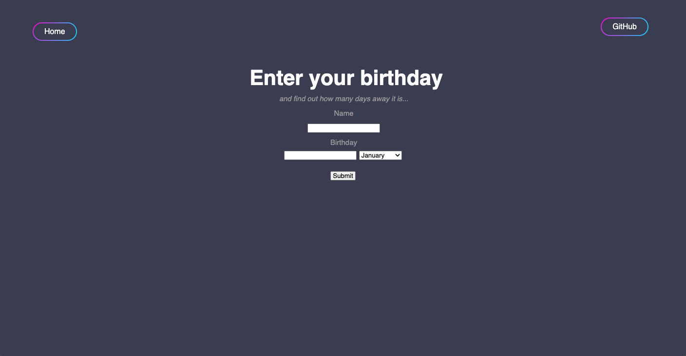
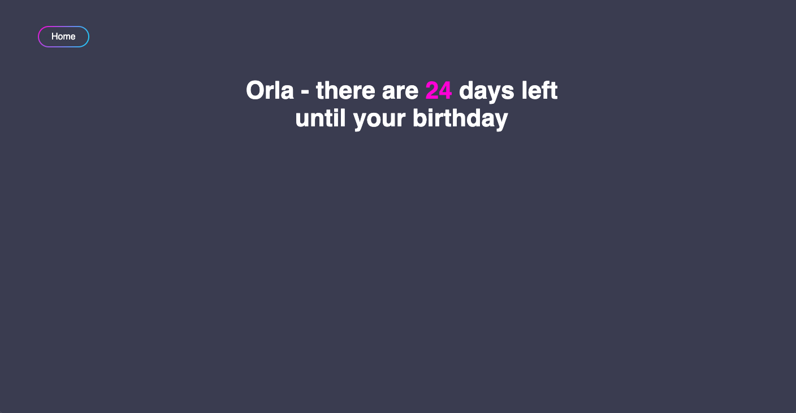
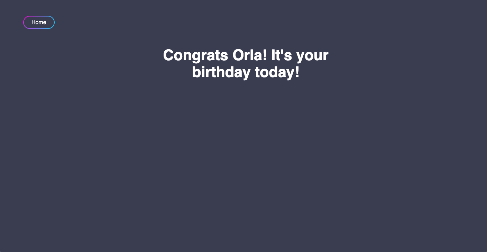

# Birthday Checker

```
As a user
So that I can see how long it is until my birthday
I want to complete a form
And see the number of days left
```

## Set up
- Install dependencies:
  * Capybara
  * RSpec
  * Sinatra
  * Webrick
- Write a feature test :white_check_mark:
- Get the feature test to pass as simply as possible

## User View
The below are what the webpage looks like in this stage of development:

### Home Screen
Including a button which links to my GitHub page and a Home button which takes the user back to the home page (on all screens)


### When it's not your birthday...
It will display how many days are left until then



### When it is your birthday...
It will display a happy birthday message
